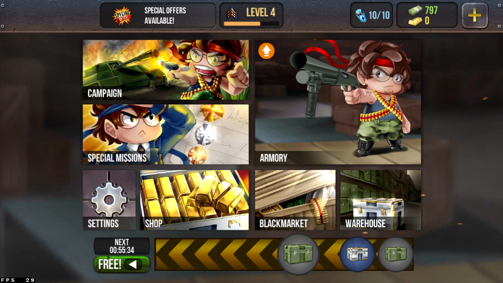
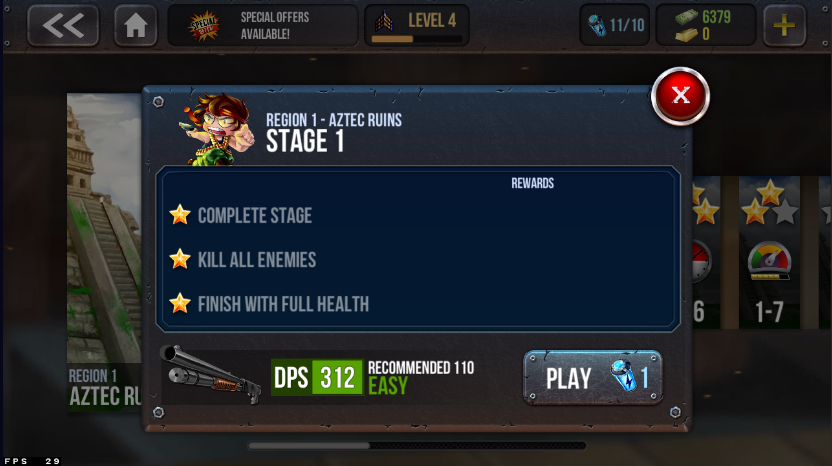
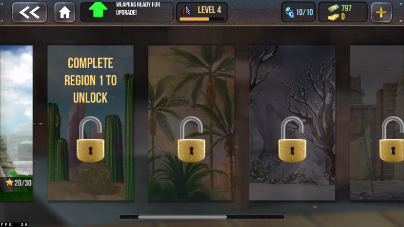
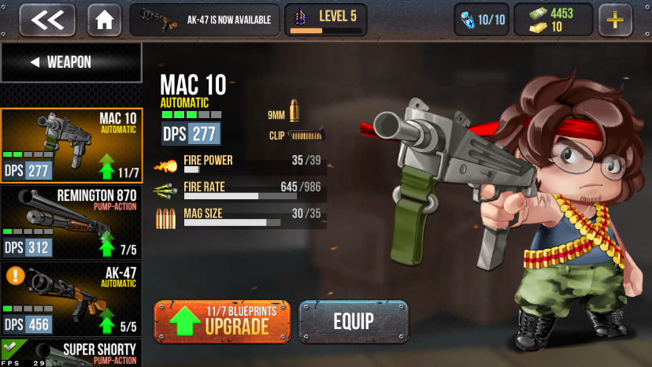
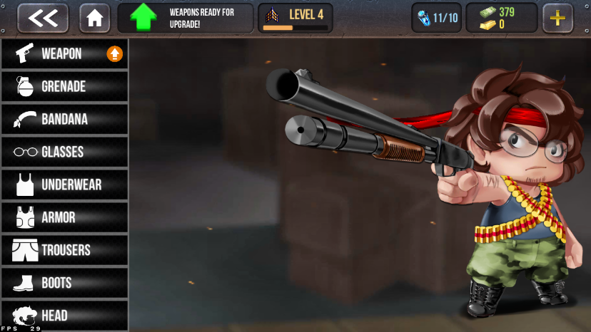
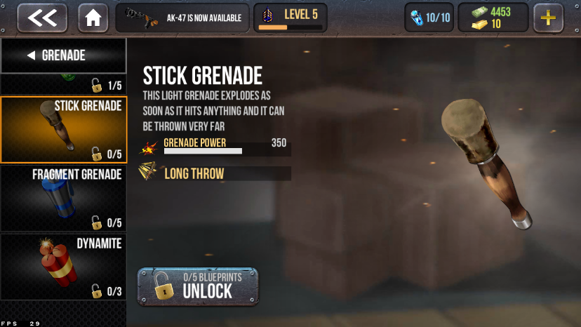
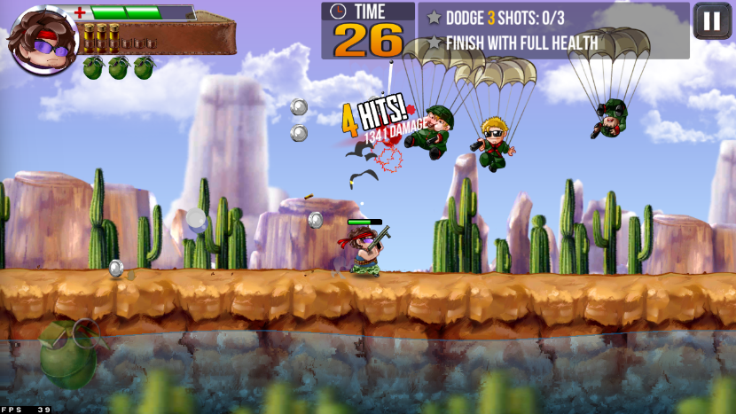
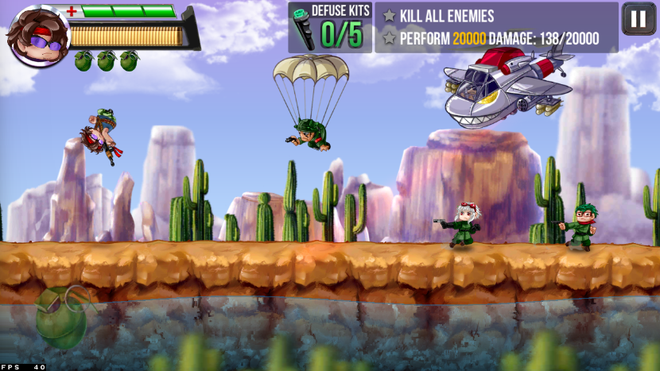
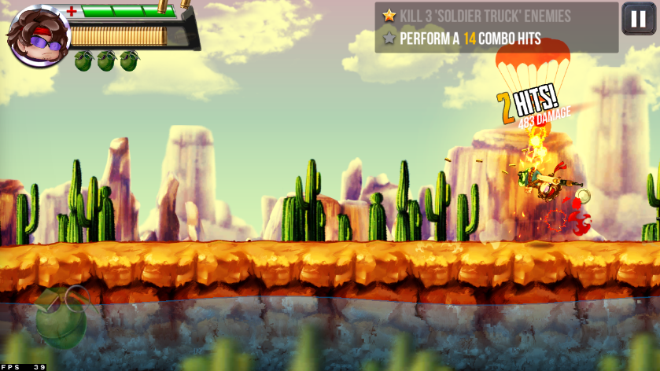
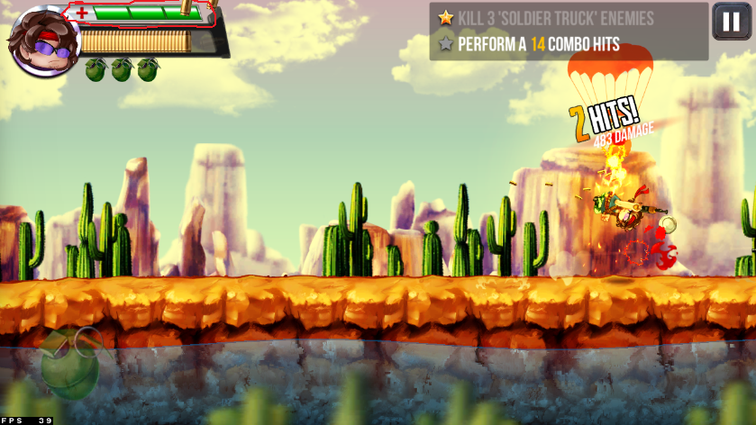

#[게임리뷰] Ramboat2

####1. 게임 소개
구글이 추천하는 인디게임 중 하나인 "Ramboat 2"라는 게임입니다 이 게임은 무기, 투척류, 헤어밴드, 안경, 옷 등등 다양한 종류의 아이템을 원하는 대로 착용하여 일정 거리를 이동하면서 적과 전투하는 게임입니다.

전투는 스테이지 별로 나누어져 있고 모든 적 처치, 타임 어택, 속도제한 등의 메인 미션과 그밖에 서브 미션 2개가 있고 미션 한 개를 완료할 때마다 별을 받고 총 3개의 별을 받을 수 있습니다

그 밖에도 스페셜 미션, 블랙마켓, 웨어하우스(상자 상점), 일정 시간 마다 무료 상자를 주는 시스템이 있습니다.

 
####2. 매력적인 점
이 게임의 빠져드는 점으로는 크게 3가지가 있다고 생각하는데 **첫 번째로는** 스테이지마다 메인 미션과 서브미션 시스템과 여러 종류 테마의 메인 REGION이 있다는 것입니다.

단순히 스테이지를 플레이하는 것이 아닌 미션을 클리어하여 별을 받아 별의 개수를 채운다는 성취감이 있고 만약 미션을 전부 클리어하지 못하여 별 3개를 못 채웠을 때 별을 채우기 위한 목표를 가지고 플레이할 수 있다는 점과 스테이지의 수가 적으면 어느 시점부터 질리고 게임을 하지 않지만 이 게임은 많은 양의 스테이지 수로 오랫동안 즐길 수 있다는 점이 있습니다.

**두번째로는** 아이템과 장신구들의 종류가 매우 많고 그하위의 아이템도 적지않게 있다는 것입니다

공격력, 발사속도, 탄창수의 양이 다른 총들, 대량의 적을 공격할 수 있는 투척무기, 치명타율을 증가시켜주는 헤어밴드, 시야범위 치명타율 회피율을 증가시켜주는 안경, 회피율을 증가시켜주는 옷, 체력 속도 회피율
추가 투척무기 공간 치명타율을 증가시켜주는 갑옷, 속도 회피율 추가 투척무기 공간 치명타율을 증가시켜주는 바지, 속도 더블점프 버프 치명타율
회피율을 증가시켜주는 신발, 그외 얼굴을 꾸밀수있는 시스템이 있고 이러한 다양한 아이템, 장신구들이 있어 정말 다양하게 게임을 즐길 수 있습니다

**세번째로는** 단순한 조작감과 모션 이펙트 타격감등이 좋다는것입니다

화면을 꾹눌러 앞으로 이동하고 좌측이나 우측으로 스와이프하여 앞뒤 점프대쉬하고 위로 스와이프 하여 점프하는 조작법이 조이스틱을 사용하는 타게임들과 달리 되게 새로웠으며 매우단순하여 편하고

현제 탄약수를 표시하는 ui가 탄약을 사용할때마다 탄약이 배출되는 모션과 대쉬할때 일정간격마다 슬로우모션이 되는 시스템이 있는데 이때 적을 조준하고 사격하는 모션 사격하면서 총에서 탄피와 장전할때 탄창이 배출되는 모션 그리고 타격 이펙트등을 자세히 볼수있고 여러 모션과 이펙트들도 상세하고 디테일해서 정말 매력적이다고 느꼈습니다

 
###3. 단점
게임에서 매력적인 부분 말고도 단점도 있었는데 첫번째로 채력시스템이 너무 아쉬웠습니다. 
적의 다양한 공격마다 다르게 채력이 깎이는것이 아닌 총으로 공격받거나 폭탄으로 공격받거나 무조건 피1칸만 깎이고 최대 채력도 3칸으로밖에 구현되지않은게 아쉬웠습니다

 
###3. 개선점
게임을 플레이 하면서 이런점을 개선하면 좋겟다라고 생각한것들이 있었는데 **첫번째로는** 출현하는 적은 많지만 대부분 공격을 하지않거나 또는 공격하는 텀이 너무길어 점프나 대쉬등을 사용할 상황이 별로없어 적들이 자주 공격하게 바뀌었으면 좋겠습니다. 
**두번째로는** 홈화면에 표시되는 에너지 UI를 터치하면 에너치 충전까지 남은시간과 골드바를 사용하여 충전시킬 수 있는 버튼이 나오는데 여기서 에너지 충전까지 남은시간을 터치해 들어가지 않아도 홈화면등에서 바로 볼수있게 추가적으로 표시하도록 개선됬으면 좋겠다고 생각했습니다. 물론 이점으로 인해 문제가 생기는 건 아니지만 개선된다면 좀더 편리해질거라 생각합니다

 
###4. 총평
전체적으로 게임의 매력적인 부분(장점)이 제가 말한것 이외에도 정말많았고 이게임의 다소 아쉬웠던점은 채력시스템 말고는 크게 단점이라고 할만한 부분은 없었다는 점에서 정말 재밌게 오랬동안 즐기실 수 있는 게임이라 생각하고 개인적으로도 게임을 플레이해보면서 되게 즐겼습니다
