#[게임리뷰] Dadish 3

####1. 게임 소개
이 게임 또한 구글에서 추천하는 인디게임중 하나인 Dadish 3라는 게임입니다. 이 게임은 슈퍼마리오라는 게임처럼 다양한 종류의 몬스터 장애물 이동수단들 지형지물들을 이용하여 친구를 만나로 가는 게임입니다

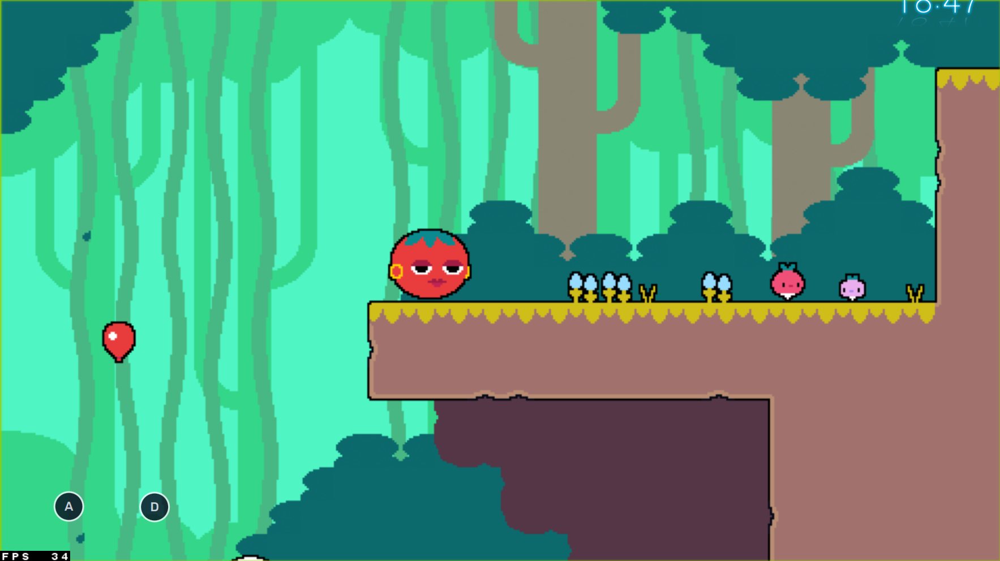
 
###2. 매력적인 부분
이 게임의 매력적인 부분은 **첫번째로** 게임을 플레이 하면서 그떄마다 다른 장애물 다양한 특징을 가진 몬스터 전략적으로 이용해야되는 지형물들이 이게임의 큰매력이라 생각했습니다.ㅈㅁㅈ

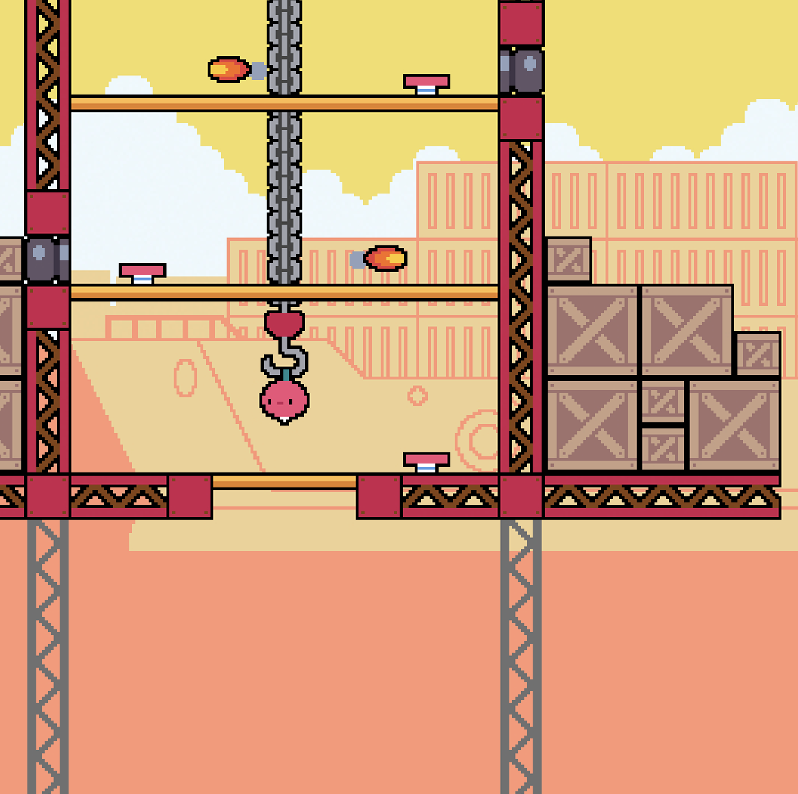

크게 장애물, 몬스터, 지형지물로 나뉘어지는데 첫번째로 장애물은 고정되어있는 장애물부터, 발사체 장애물, 늪 장애물, 회전 또는 이동하는 장애물 등등

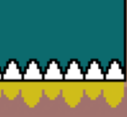 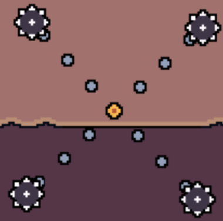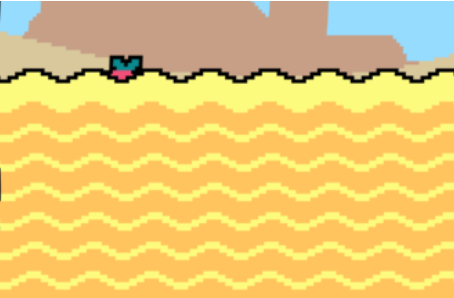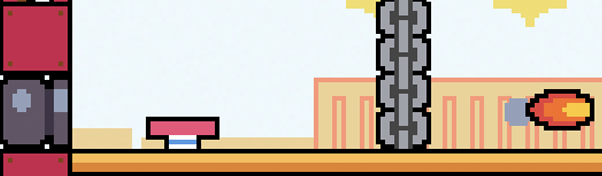

두번째로 몬스터는 무기를 던지는 몬스터, 여러개로 나뉘어 공격하는 몬스터, 폭탄을 떨어뜨리는 몬스터, 점프하는 몬스터 등등

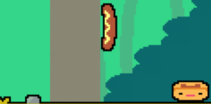 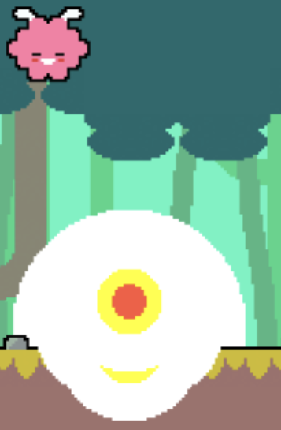 

세번째로 지형지물로는 점프대, 밟을시 부서지는 블록, 대포, 일정시간 뒤에 사라지는 블록 등등 같은 종류의 지형 몬스터 장애물이 반복되는것이아닌 매번 다른 종류의 지형 몬스터 장애물이 나와 매번 새롭고 그러한 지형을 이용하고 몬스터의 특성을 파악하고 장애물의 패턴을 읽어 플레이하다보니 질리지않고 재밌게 플레이했습니다.

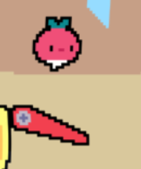 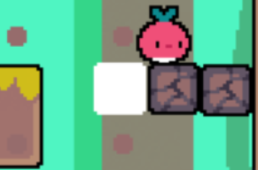 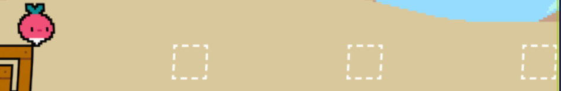

**두번째로** 각맵마다 가기 어려운 장소나 숨겨져있는 별을 찾는 시스템이 게임의 매력적인 점중 하나라고 생각합니다. 만약에 게임이 너무 쉽게 느껴지거나 숨겨져있는 별을 찾아보고 싶거나 별을 수집하고싶다는 목표를 가지고 게임을 더 즐겁게 플레이할 수 있기 떄문입니다.

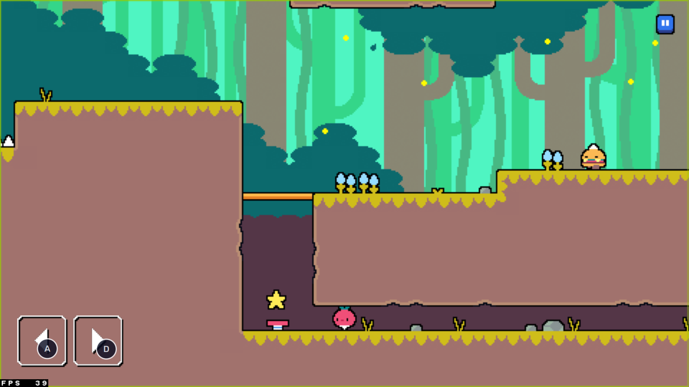 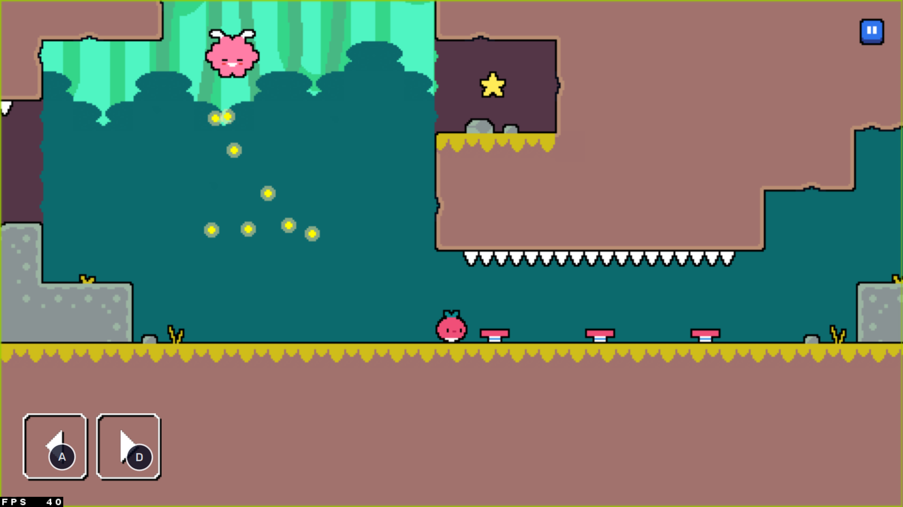 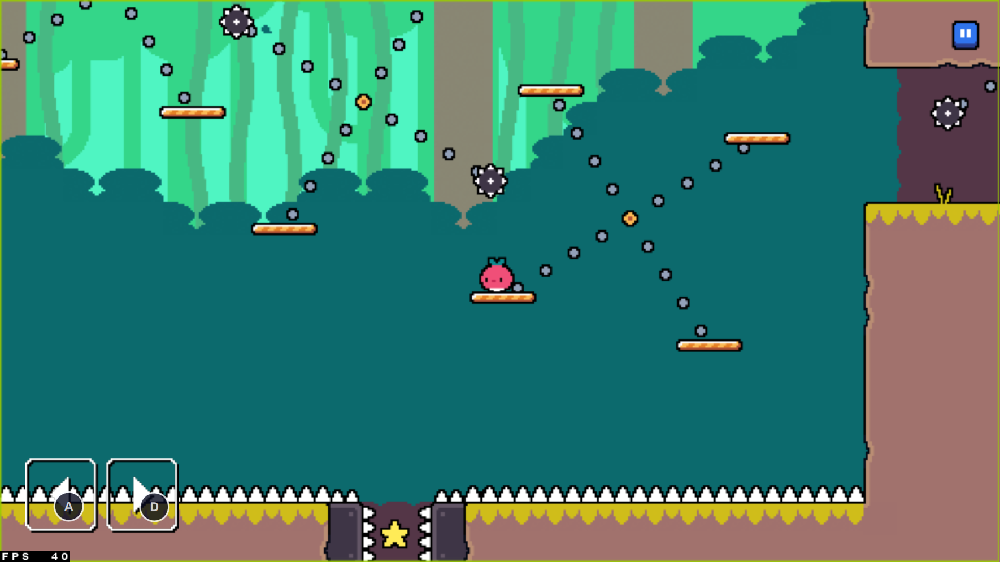
 
###3. 단점
**첫번째로** 게임의 난이도가 대체적으로 높고 몇몇 스테이지는 무조건 한번쯤은 죽게 만든다거나 어떤식으로 지형등을 이용할지 모르면 죽어야되어야했고 거의다 도착해서 죽으면 처음부터 다시 시작해야된다는 점이 이게임의 단점으로 크게 다가왔습니다.  
**두번째로** 게임플레이 하면서 조작하기가 불편했습니다. 좌우 이동하는 버튼과 화면터치로 점프로 구성된 매우 단순한 조작법이지만 몇몇 스테이지에서 정밀하게 조작해야될때 그렇지 못한게 어렵기도하고 불편하게 다가왔습니다.
 
###4. 개선점
마지막에 친구를 만날때나 보스나 다른친구를 만날때 대화하는 이야기가 나오는데 그 내용을 스킵할 수 있게 만들면 좋겠습니다.
 
###5. 총평
게임이 매우단순하고 반복되는 요소없이 매번 새로워 좋았지만 지형지물을 이용하여 플레이하는 복잡한 스테이지가 종종있고 전체적으로 난이도도 꽤높았습니다
