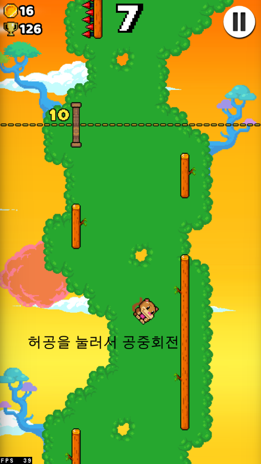
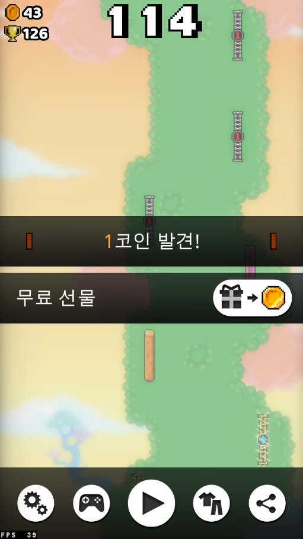
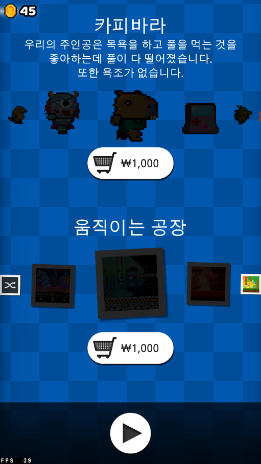
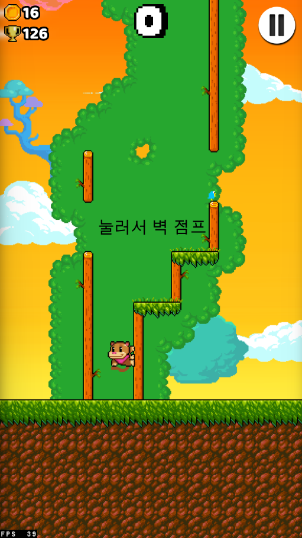
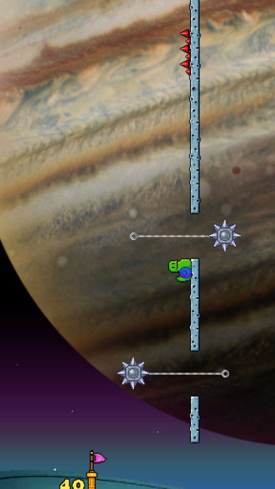
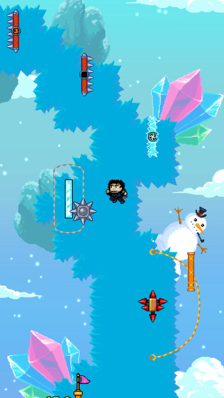
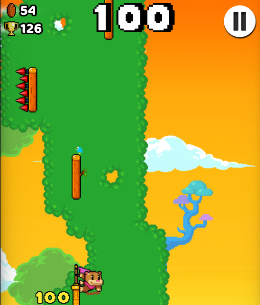
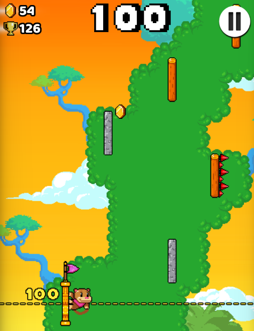

#[게임 리뷰] Wall Kickers

####1. 게임 소개
이번에도 구글에서 추천하는 인디게임 중 하나인 "Wall Kickers"라는 게임입니다. 화면을 눌러 벽 점프, 화면을 길게 눌러 더 높이 점프, 허공에서 화면을 눌러 공중회전을 하는 조작법을 이용해 벽을 타고 올라가는 게임입니다.

기회는 총 4번이 주어지고 4번 죽을 시 게임 종료 UI가 뜨며 재시작 시 맵이 바뀌어 다시 시작하는 시스템입니다.

그 밖에도 무료로는 사용할 수 없지만 현질할시에 캐릭터와 맵을 원하는 대로 바꿀 수 있는 시스템도 있습니다.

 
####2. 매력적인 점
이 게임의 끌리는 부분은 게임을 좀 더 즐길 수 있는 요소가 많다는 것입니다.

첫 번째로 적지 않은 여러 맵들과 정말 많은 캐릭터들로 자신이 원하는 대로 맵과 캐릭터들을 선택하고 계속 바꿔가며 오랫동안 플레이할 수 있습니다.

두 번째로 게임을 플레이하면서 나오는 함정의 종류가 무수히 많고 단순히 무작위로 설치돼있는 게 아니라 후반부로 갈수록 머리를 써야 지나갈 수 있을 정도로 복잡하게 설치돼있어 더욱 재밌게 게임을 플레이할 수 있습니다.

세 번째로 플레이하면서 여러 번 죽어 4번에 기회를 다 쓰게 되면 계속 똑같은 맵에서 다시 시작하는 것이 아닌 새로운 지형으로 바뀌게 되기 때문에 같은 지형을 반복함으로써 생기는 지루함이 없어집니다.

 
 
###3. 단점
개인적으로 장점과 단점이 비슷하지만 단점이 좀 더 크다고 생각합니다 **첫 번째로** 게임의 진입장벽이 너무 높다고 느꼈습니다. 게임을 계속 플레이해보면서 조금씩 실력이 늘긴 했지만 너무 어려워 계속 죽고 나아가지를 못하여 성취감이 없어 앞서 말한 다양한 장애물과 일정 기회를 다사 용하면 맵이 바뀌는 등의 시스템이 있더라도 금방 흥미를 잃고 질리게 됐습니다 
**두 번째로** 게임을 좀 더 즐길 수 있게 해주는 다양한 맵과 캐릭터들이 있지만 무슨 미션을 달성하여 잠금 해제하거나 게임 플레이를 통해 얻은 골드로 구매하여 잠금 해제하는 것이 아닌 무조건 현질을 해서 잠금 해제를 해야 된다는 것에서 너무 큰 단점이라 생각이 들었습니다
 
###3. 개선점
게임을 플레 하면서 개선되었으면 하는 점들이 있었는데 **첫 번째로** 일정 점수 이상을 달성하거나 특정 행위를 하는 등의 미션 시스템을 만들고 미션을 달성할 시 캐릭터를 잠금 해제해 주는 등의 시스템이 생겼으면 좋겠습니다 게임에서 에셋들의 종류는 다양하지만 뭔가 성취할 수 있는 부분의 시스템이 없어 게임에 대한 애착이 없고 쉽게 질릴 수 있어 뭔가 성취감을 줄만한 시스템이 필요하다 생각합니다. 
**두 번째로** 체크포인트 시스템을 구현되면 좋겠다고 생각합니다. 어렵게 장애물들을 피해 가며 꽤 많이 올라갔는데 잠깐의 실수 등으로 다시 맨 처음부터 플레이해야 된다는 것이 게임의 흥미를 크게 잃은 부분 중 하나였습니다. 일정 점수마다 체크포인트를 만들어 체크포인트를 찍을 시 주어진 4번의 기회 동안은 죽으면 미리 찍어둔 체크포인트부터 시작할 수 있도록 만들면 좀 더 게임을 즐길 수 있다고 생각합니다.
 
###3. 총평
다른 게임들과 비교했을 때 확실한 좋은 장점들을 가지고 있었지만 단점들이 그 장점들을 상쇄시켜버려 쉽게 흥미를 잃고 게임을 오랫동안 즐길 수 없었던 게 아쉬웠습니ㄷ