#[게임리뷰] Pa!nt

####1. 게임 소개
2022 Google Play 인디게임 페스티벌 Top 10 선정작인 Pa! nt라는 게임입니다. 캐릭터와 구조물의 색상이 같으면 통과되고 다르면 통과되지 않는 시스템인 이 게임은 주인공인 문어 캐릭터의 색상을 상황에 맞는 색상의 아이템을 찾아 캐릭터의 색을 바꾸고 최종적으로 문을 칠하는 아이템을 찾아 문을 칠하고 클리어하는 게임입니다.

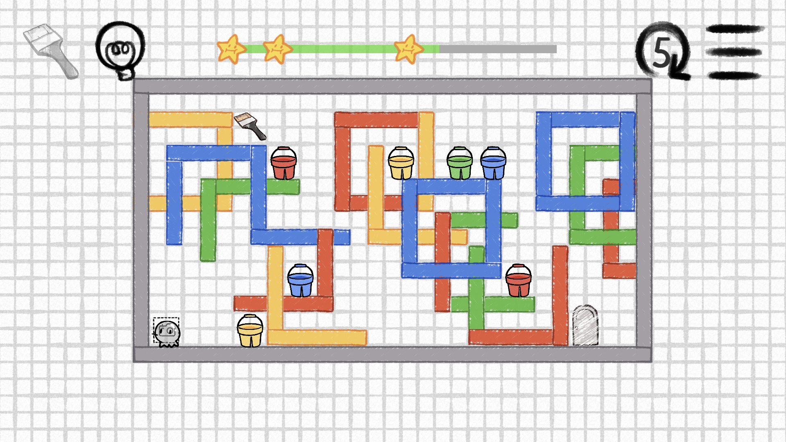
 
###2. 매력적인 부분
**첫 번째로** 게임의 규칙이 캐릭터의 색상과 같은 색상의 구조물을 통과 헐 수 있고 그 외에 색상의 구조물을 통과 못한다는 점을 이용해 게임을 플레이한다는 규칙이 다른 비슷한 유형의 게임들의 규칙과 비교했을 때 비해 독특하고 창의적이었습니다.

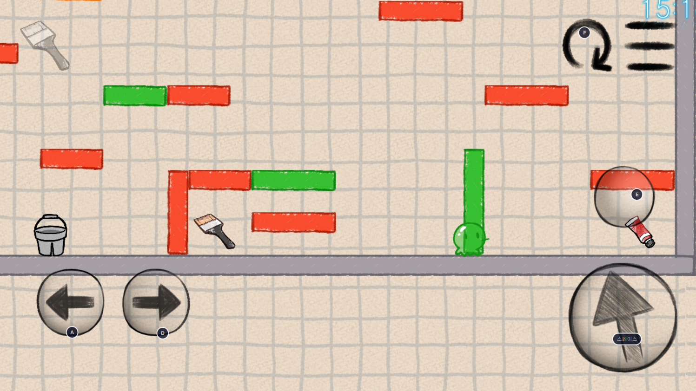 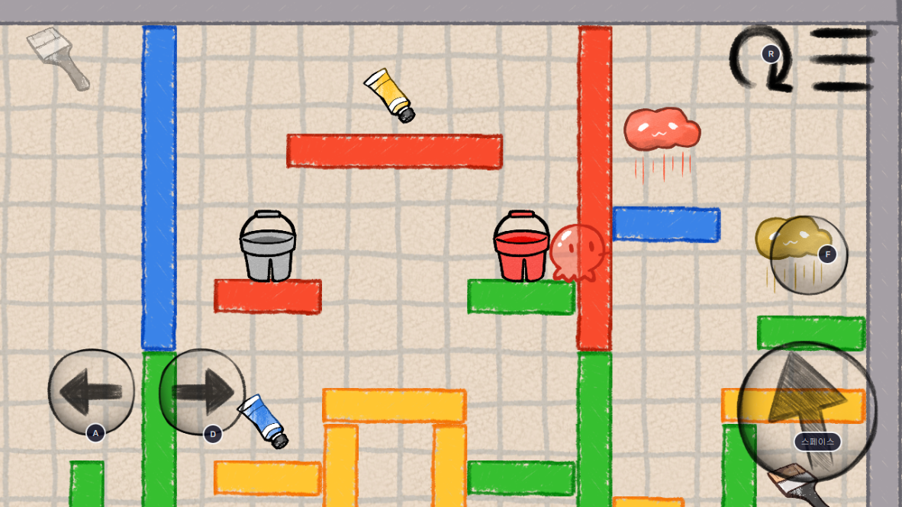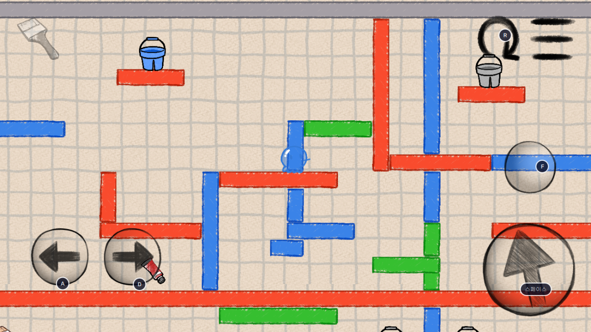 

**두 번째로** 이 게임은 물감 물감통 4가지 색상의 구조물 시스템을 전략적으로 이용하여 문을 칠하기 위한 붓을 얻고 문까지 가는 게임인데 물감과 물감 통을 어떻게 이용하느냐 또 지정된 위치를 순간이동할 수 있는 아이템이나 나 상하를 반전시켜주는 아이템이나 나 특정 구조물 아래를 지나갈 시 그 아이템의 해당하는 색상으로 캐릭터의 색상을 바꿔주는 등의 아이템들을 어떤 식으로 이용하여 구조물을 이동할 것인지라는 수많은 변수 따라 클리어의 여부가 달라진다는 점에서 크게 매력을 느꼈습니다.

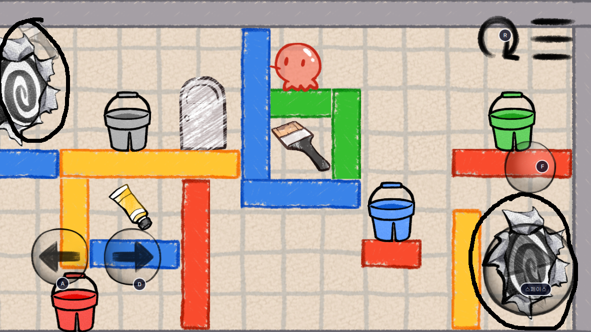 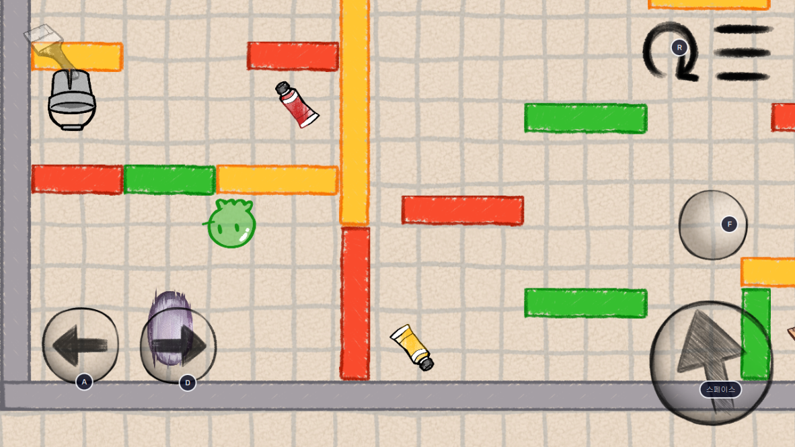
 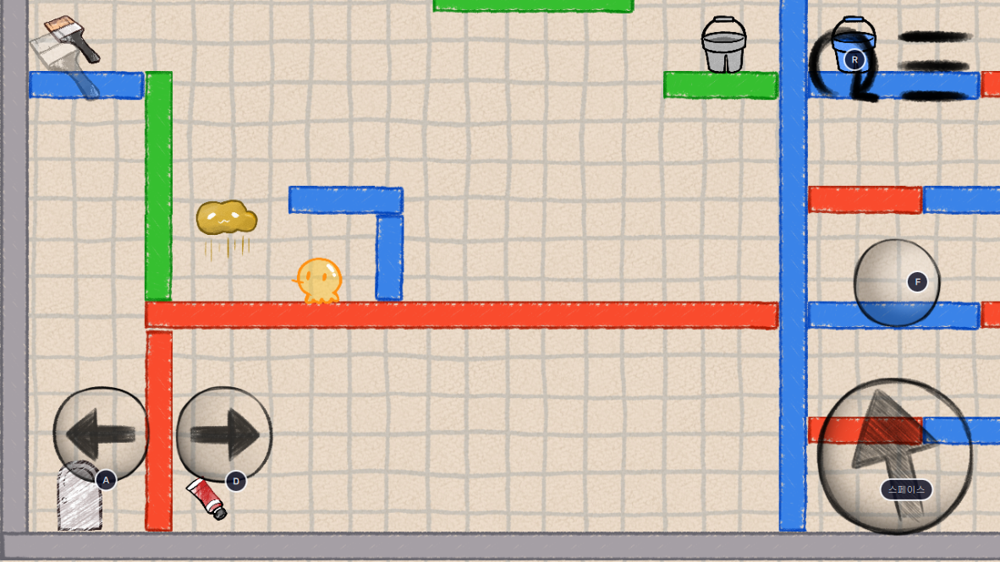 

**세 번째로** 제작되어 있는 스테이지들을 플레이하는 것이 아닌 자신이 직접 여러 아이템들과 문 캐릭터 북 등의 위치를 직접 정하고 구조물도 직접 만들고 아이템, 붓, 구조물을 좌우상하로 움직일 수 있도록 지정하여 하나의 스테이지를 만들 수 있는 시스템이 있고 아직은 테스트 단계라 잘 작동하지는 않지만 자신이 만든 스테이지를 올리고 다른 사람이 만든 스테이지 또한 플레이할 수 있는 시스템이 있다는 것이 이 게임의 가장 큰 매력이라고 느꼈습니다.

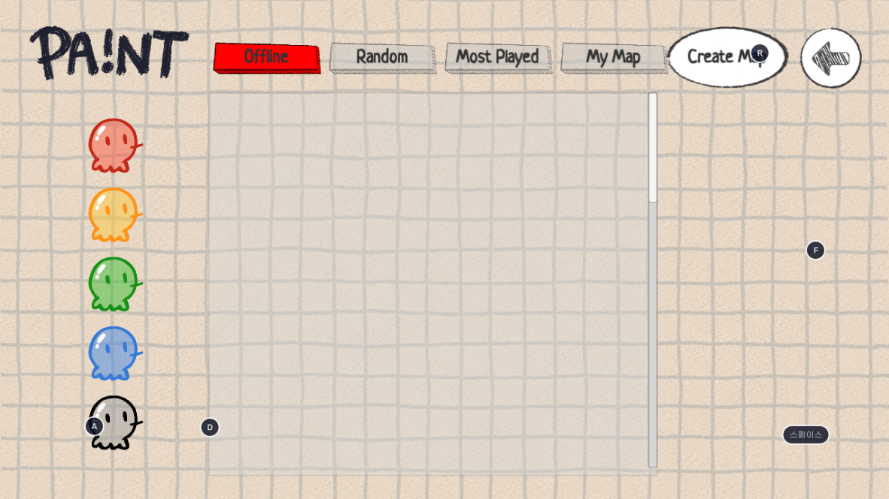
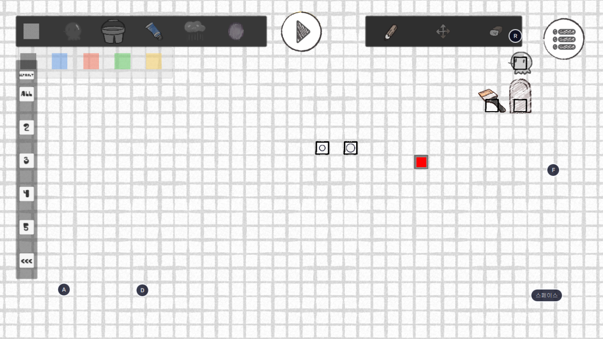
 
###3. 단점
게임을 플레이하면서 원하는 색상의 구조물이 어딨는지 어떤 식으로 이동할 수 있는지 또는 물감이나 물감통 아니면 다른 아이템들의 위치가 어딨는지를 플레이하면서 확인해야 되는데 시야가 너무 좁아 확인하기 어렵습니다. 게다가 어려운 후반부 스테이지로 갈수록 아이템들의 위치를 확인하고 여러 가지의 변수를 생각하면서 어떻게 플레이해야 될지 생각해야 되는데 시야가 좁아 확인을 못하고 확인하려고 계속 돌아다니다 보면 캐릭터의 속도가 느린 편이라 답답하기도 하고 계속 실패해 처음부터 다시 시작하는 걸 반복하는 등에 문제로 게임을 오래 하기 힘들다고 느꼈습니다.

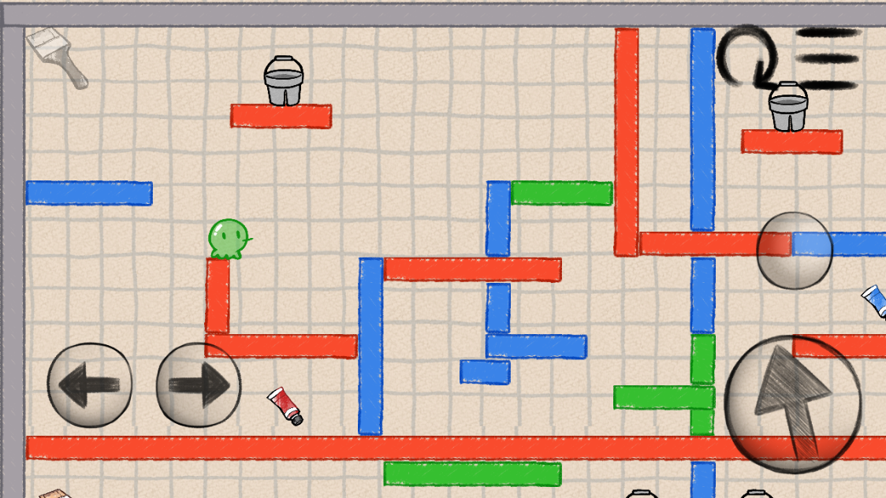
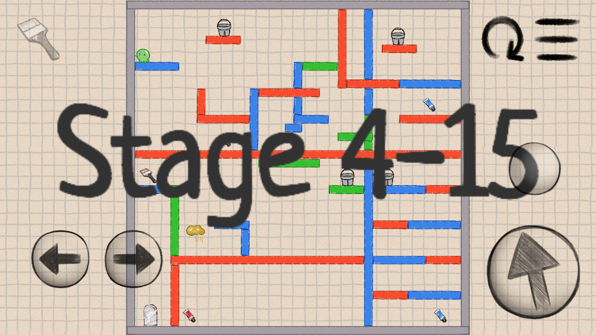
 
###4. 개선점
크게 챕터 5개로 나누어져 있고 그 안에 스테이지가 있는데 클리어 된 스테이지가 따로 표시가 안돼 보기 불편하여 클리어 한 스테이지와 챕터를 색칠하여 클리어 된 챕터와 스테이지라고 표시가 돼있으면 보기 편할 것 같습니다.
 
###5. 총평
비슷한 장르의 게임들과 비교했을 때 규칙이 독특하고 창의적이어서 새롭게 다가와졌고 다양한 아이템들과 구조물을 이용한 전략적인 플레이 또 자신이 직접 맵을 만들 수 있는 시스템 등 게임의 매력적인 부분이 많았지만 게임을 플레이할 때 시야가 좁은 것은 많이 불편했습니다.
